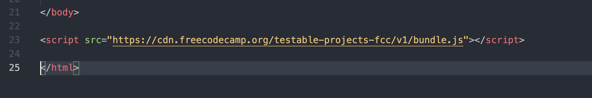

# Homework Lecture I 
## Tài liệu - HTML/CSS 
- HTML & CSS đa phần chú trọng vào cú pháp khai báo nên có rất nhiều tag, css property để định nghĩa một  chức năng, định dạng nào đó. Giới thiệu hết và toàn bộ sẽ rất mất nhiều thời gian và khó để tiếp thu.( chỉ nghe chứ không làm)
- Các bài tập ở dưới sẽ giúp các bạn code quen tay, biết ứng dụng CSS và HTML một cách cơ bản.
- Thắc mắc sẽ được mình giải đáp qua messenger hoặc classroom
- Nơi có chứa nhiều nguồn tài liệu là https://w3schools.com và https://developer.mozilla.org/en-US/
- Các bạn có thể xem qua các tutorials ở **w3schools** hoặc **freecodecamp** để nắm thêm kiến thức (khuyến khích)
- Và để code giỏi, hoặc ít nhất là biết code thì các bạn phải code
- 
### Flex Froggy
- Display là thứ rất quan trọng trong CSS, giúp ta sắp xếp vị trí của các element.
- Flex box là một "display" rất quan trọng.
- Truy cập vào trang sau : https://flexboxfroggy.com
- Phá đảo game bằng cách sử dụng flex box
### Tribute Page
- Truy cập vào trang sau : https://freecodecamp.org 

- Đăng ký tài khoản và đăng nhập bằng gmail (hoặc email )


- Chọn Responsive Web Design Certification (300 hours) > Responsive Web Design Projects > Build a Tribute Page (Đơn giản hơn thì click thẳng vào [đây này](https://www.freecodecamp.org/learn/responsive-web-design/responsive-web-design-projects/build-a-tribute-page) )

- Đọc kỹ các User Story : là các yêu cầu của người dùng - để bài, đáp ứng đủ các yêu cầu đó
 v
- Làm một trang giống như ở link [sau](https://codepen.io/freeCodeCamp/full/zNqgVx.)

- Nếu các bạn muốn kiểm tra xem có đáp ứng có đủ các User Story thì có thể sử dụng tool của freecodecamp.org cung cấp bằng cách copy đoạn code sau và dán vào dưới tag body của file .html 

```js
<script src="https://cdn.freecodecamp.org/testable-projects-fcc/v1/bundle.js"></script>
```

**NOTES**
1. Sử dụng các thẻ html cơ bản như h1,p,b,i,ul,li,img,..
2. Sử dụng file CSS theo dạng external - Nghĩa là viết ra một file riêng 
3. Biết được các sử dụng các thuộc tính CSS cơ bản, sử dụng thuộc tính display để căn chỉnh layout 
---
Mindx Technology School 